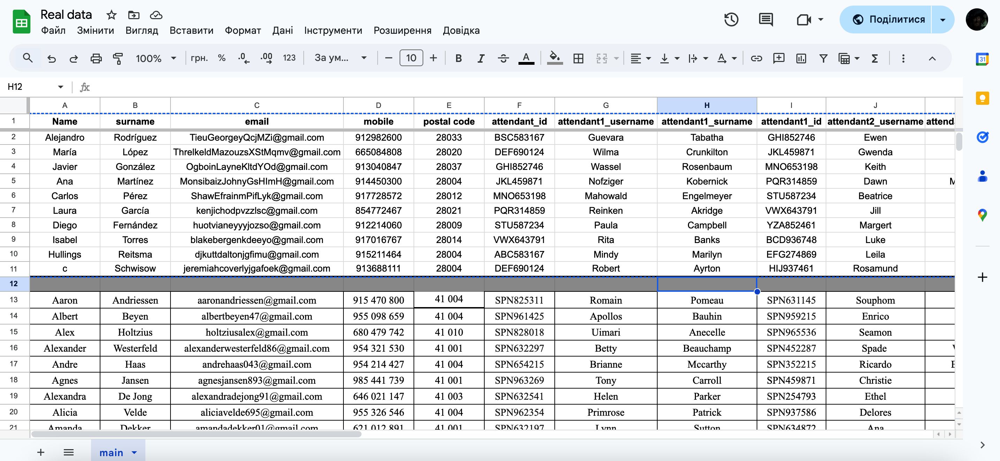
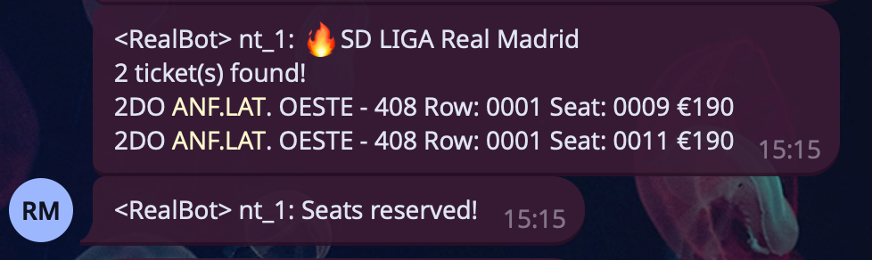

Automatically monitors Real Madrid ticket availability, filters seats by price and quantity settings, and attempts to reserve tickets. Supports notifications via Telegram.

# Table of Contents

- [How it works](#how-it-works)
- [Requirements](#requirements)
- [Get Started](#get-started)
- [Get Started (With Python)](#get-started-with-python)
- [Spreadsheet Configuration Sample](#spreadsheet-configuration-sample)
- [GUI sample](#gui-sample)
- [Telegram Message Sample](#telegram-message-sample)
- [Notification Service Sample](#notification-service-sample)
- [Real Madrid API](#real-madrid-api)

# How it works

The script reads bot configuration from localstorage.ticketBotSettings, and repeatedly queries the Real Madrid venue API (channels-api/v1/catalog/sessions/.../venue-map). It filters available seats by price and quantity, selects nearest seats if it is possible and reserves it. It also automates some routine UI actions (cookie/confirm/queue buttons), and can autofill buyer/attendant data from a Google Sheet and notify a local Telegram helper when tickets are purchased.

# Requirements

- Google Chrome (<= v129) or Adspower SunBrowser
- Tampermonkey extension
- BP Proxy Switcher extension and static proxies (optional)
- Optional: Python <= 3.9
- Optional but recommended: a local notification service listening at http://localhost:3309/sendTelegramMessage (used for _notify and _notify_error calls) and Telegram bot/chat IDs.
- If using autofill: the Google Sheet must be publicly queryable (or accessible by the script's fetch URL).

# Get Started

1. Install Tampermonkey and add the userscript (copy-paste the provided script into a new Tampermonkey script).
2. Enable Developer Mode and give all the necessary permissions to Tampermonkey extension in your browser.
3. (Optional) Run a local notifier that accepts POSTs at http://localhost:3309/sendTelegramMessage if you want Telegram messages.
4. (Optional) Configure Google Sheet data for fast Fill In during checkout.
5. Navigate to the ticket page ($ssettings.url).
6. Fill in right-bottom configurations, so that script know which price and amount of tickets it should look for.
7. To stop or test: disable the Tampermonkey script or remove localstorage.ticketBotSettings in devTools.

# Get Started (With Python)

1. Install requirements ```pip install -r requirements.txt``` or [install.bat](install.bat)
2. Optional: Setup your Google Sheets following the example in [Spreadsheet Configuration Sample](#spreadsheet-configuration-sample)
3. Optional: Run a local notifier that accepts POSTs at http://localhost:3309/sendTelegramMessageg if you want Telegram messages.
4. Run bot with ```python -m main.py``` or [run.bat](run.bat)
5. There will be opened a GUI that you should fill in with: Initial url, browsers amount or adspower ids, proxies etc. (Initial url should be a url to desired match). []
6. Once you clicked Start button the browsers will be run and configured automatically, you should wait untill it automatically enters initial url.
7. Fill in data about min, max price and tickets amount in embbeded interface on event's page (initial url).
8. To stop or test: disable the Tampermonkey script or remove localstorage.ticketBotSettings in devTools.

# Spreadsheet Configuration Sample

All configurations should be written on this table in sheet named "main":
https://docs.google.com/spreadsheets/d/1TniFrgJi9yJ2eUiCzCRistLUDCzn_v3udrZwhOzmaYI/edit?gid=0#gid=0

| Name                    | Description                                                     |
| ----------------------- | --------------------------------------------------------------- |
| **Name**                | Buyer’s first name used to autofill checkout forms.             |
| **surname**             | Buyer’s last name used to autofill checkout forms.              |
| **email**               | Buyer’s email used for contact and confirmation in checkout.    |
| **mobile**              | Buyer’s phone number used in checkout contact details.          |
| **postal code**         | Buyer’s postal or ZIP code for billing/shipping details.        |
| **attendant_id**        | ID or document number for the main buyer used in checkout.      |
| **attendant1_username** | First attendee’s first name used to fill attendee details.      |
| **attendant1_surname**  | First attendee’s last name used to fill attendee details.       |
| **attendant1_id**       | First attendee’s ID or document number.                         |
| **attendant2_username** | Second attendee’s first name used in attendee form.             |
| **attendant2_surname**  | Second attendee’s last name used in attendee form.              |
| **attendant2_id**       | Second attendee’s ID or document number.                        |
| **attendant3_username** | Third attendee’s first name used in attendee form.              |
| **attendant3_surname**  | Third attendee’s last name used in attendee form.               |
| **attendant3_id**       | Third attendee’s ID or document number.                         |
| **ADS**                 | Optional reference to adspower browser id which data is used for|

## Spreadsheet Configuration sample



# GUI sample


# Telegram message sample



# Notification service sample

[server.js](samples/server.js) - An example of a local notification service listening at http://localhost:3309/sendTelegramMessage written in node.js.

# Real Madrid API

Main tickets.realmadrid.com endpoints that bot uses.

## Endpoints

---

/channels-api/v1/catalog/sessions/`<SESSION_ID>`

METHOD: GET

Example: https://tickets.realmadrid.com/channels-api/v1/catalog/sessions/2564314/venue-map?viewCode=V_blockmap_view

Response body:

```json
{
  "id" : 2564314, // SESSION_ID
  "name" : "REAL MADRID",
  "type" : "SESSION",
  "forSale" : true,
  "soldOut" : false,
  "onSale" : true,
  "event" : {
    "id" : 47170,
    "name" : "Campeonato de Liga 2025 26 ATM",
    ...
  }
  ...
}
```

---

/channels-api/v1/catalog/sessions/`<SESSION_ID>`/venue-map?viewCode=V_blockmap_view

METHOD: GET

Example:
https://tickets.realmadrid.com/channels-api/v1/catalog/sessions/2564314/venue-map?viewCode=V_blockmap_view

Response body:

```json
{
  "id" : 1245102, 
  "name" : "Riyadh Air Metropolitano",
  "code" : "V_blockmap_view",
  "rootView" : true,
  "svgUrl" : "https://difvffldo7jzh.cloudfront.net/pro/1/53/configRecinto/87164/svg/rest_1245102_1753282071021.svg",
  "aggregated" : false, 
  "element" : {
    "links" : [ {
      "svgId" : "E7BA357D-DB6C-61C1-D57D-FEDB6E732ECB",
      "availability" : {
        "type" : "BOUNDED",
        "total" : 15196,
        "available" : 313 // availability of tickets in this area
      },
      "targetView" : {
        "id" : 1245122, // <VIEW_ID> query parameter
        "code" : "V_fondosur", // <VIEW_CODE> query parameter
        "name" : "Fondo sur", 
        "sectors" : [ {
          "id" : 1567767,
          "code" : "S_437",
          "name" : "FONDO SUR GRADA ALTA - 437" 
        }, {
          "id" : 1567766,
          "code" : "S_436",
          "name" : "FONDO SUR GRADA ALTA - 436" 
        },
        ...
      }]
    }]
  }
  ...
}
```

---

/channels-api/v1/catalog/sessions/`<SESSION_ID>`/venue-map?viewCode=`<VIEW_CODE>`

METHOD: GET

Example:
https://tickets.realmadrid.com/channels-api/v1/catalog/sessions/2564314/venue-map?viewCode=V_336

Response body:

```json
{
  "id" : 1244957,
  "name" : "FONDO SUR GRADA ALTA - 336",
  "code" : "V_336",
  "rootView" : false,
  "svgUrl" : "https://difvffldo7jzh.cloudfront.net/pro/1/53/configRecinto/87164/svg/rest_1244957_1753282063251.svg",
  "aggregated" : false,
  "element" : {
    "seats" : [ {
      "id" : 262848820,
      "svgId" : "300562222",
      "type" : "PRIMARY",
      "code" : "S_336-6-3",
      "status" : "OCCUPIED",
      "rowName" : "6",
      "row" : {
        "name" : "6",
        "order" : 0
      },
      "num" : "3",
      "accessibility" : "NORMAL",
      "visibility" : "NORMAL",
      "priceType" : {
        "id" : 323735,
        "name" : "FONDO G. ALTA"
      },
      "sector" : {
        "id" : 1567726,
        "code" : "S_336",
        "name" : "FONDO SUR GRADA ALTA - 336",
        "order" : 170
      },
      "order" : 3
      ...
      } ],
      ...
    },
  ...
}
```
---

/channels-api/v1/checkout/seats

METHOD: POST

Payload:

```json
{
  "sessionId": 2564314,
  "seats":[
    {
      "id":262866964
    }
  ]
}
```

Response body:

```json
{
  "channel" : {
    "id" : 108,
    "name" : "Atlético de Madrid"
  },
  "id" : "512388348c0f984f87832e91a74028e8",
  "language_code" : "es-ES",
  "status" : {
    "type" : "BASKET",
    "expires_in" : {
      "value" : 600,
      "time_unit" : "SECONDS",
      "date" : "2025-11-14T17:58:58Z"
    }
  },
  "items" : [ { // this array represents purchased tickets
    "id" : 262866964,
    "type" : "SEAT",
    "ticket_type" : "GENERAL",
    "allocation" : {
      "sectorCode" : "S_504",
      "rowName" : "0026",
      "seatName" : "0014",
      "type" : "NUMBERED",
      "event" : {
        "id" : 47170,
        "name" : "Campeonato de Liga 2025 26 ATM",
        "entity" : {
          "id" : 53,
          "name" : "Club Atlético de Madrid "
        },
        ...
      },
      ...
    },
    ...
  }, ],
  ...
}
```

---
